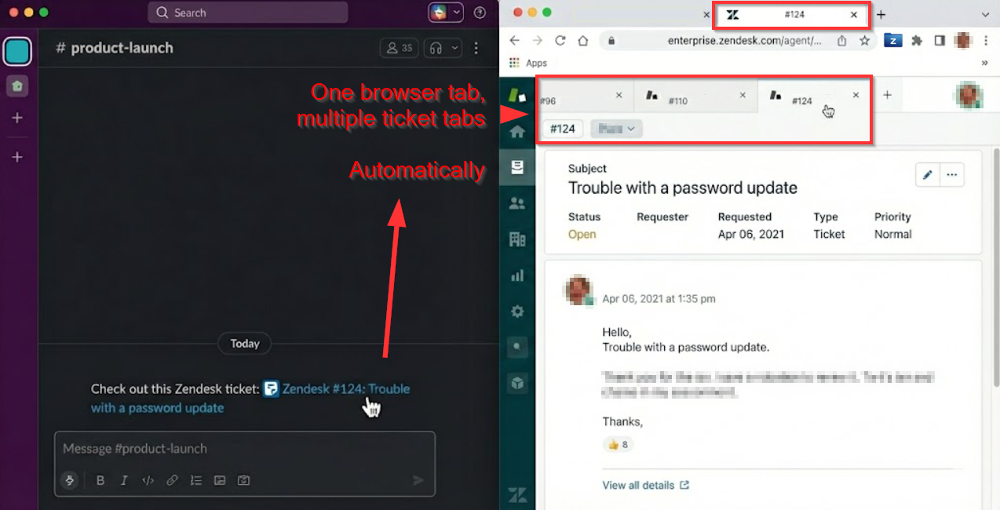

# Zendesk QuickTab (Modernized)

**Well behaved browser tabs for Zendesk agents**

Zendesk QuickTab for Chrome makes tab management a little easier by monitoring when a new browser tab is navigating to a Zendesk Support `/agent` link. QuickTab checks if you have an agent browser tab already open. If you do, QuickTab opens the link on the existing agent tab and closes the new one. This keeps the number of Zendesk Support browser tabs down to just one.

## Features
*   **Automatic Tab Management:** Keeps your browser clutter-free by ensuring only one Zendesk Agent tab is open.
*   **Focus Switching:** Instantly switches focus to your existing agent tab when you click a ticket link.
*   **Configurable:** Choose to manage all URLs, only ticket URLs, or disable temporarily via the popup.

## Modernization Status (2026)
This project is a modernized fork of the original (deprecated in 2020).
*   **v1.2.2 (Current):** Added a new welcome screen to guide users upon installation.
*   **Privacy First:** No external tracking. Runs entirely locally in your browser.
*   **Modern Tech:** Built with Webpack 5 and Vanilla JS (jQuery removed).



## Installation

### Easiest
The **Zendesk QuickTab** extension is now available on the Chrome Web Store!

[](https://chromewebstore.google.com/detail/zendesk-quicktab/fjoifbimocbapgodjieaecipndjciopm)

Simply click the badge above or [follow this link](https://chromewebstore.google.com/detail/zendesk-quicktab/fjoifbimocbapgodjieaecipndjciopm) to add it to your browser.

### Quick Start (No Coding Required)
If you just want to use the extension without building it yourself:
1.  Go to the [Releases](https://github.com/zachvier/QuickTab/releases) page.
2.  Download the latest version (`.zip` file).
3.  Unzip the file on your computer.
4.  Open Chrome and go to `chrome://extensions`.
5.  Enable **Developer Mode** (toggle in the top right corner).
6.  Click **Load unpacked** and select the unzipped folder.

### For Developers (Build from Source)
1.  **Clone the repository:**
    ```bash
    git clone https://github.com/zachvier/QuickTab.git
    cd QuickTab
    ```

2.  **Install Dependencies:**
    ```bash
    npm install
    ```

3.  **Build the Project:**
    ```bash
    npm run build
    ```
    This generates a `dist/` folder containing the extension.

4.  **Load into Chrome:**
    *   Open Chrome and go to `chrome://extensions`.
    *   Enable **Developer Mode** (top right toggle).
    *   Click **Load unpacked**.
    *   Select the `dist` folder from this project.

## Development

*   **Watch Mode:** `npm run dev` (Rebuilds automatically on file changes)
*   **Build:** `npm run build`

### Special Thanks
<a href="https://github.com/justcarlson">
  
  <br /><sub><b>justcarlson</b></sub>
</a>

## License
Apache License 2.0
